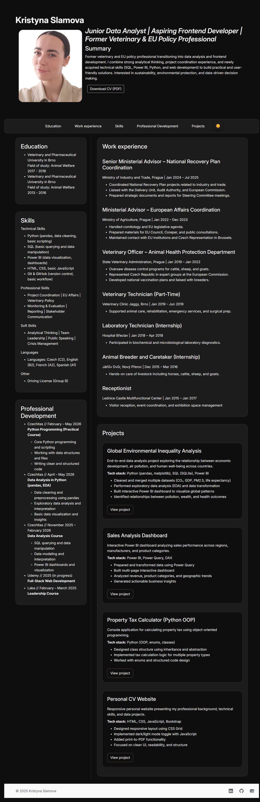

# CV Website
## 📌 About the Project

This project is a responsive personal CV and portfolio website designed to present my professional background, technical skills, and transition into data analysis and frontend development.

The goal was not only to build a website, but to create a clear and structured presentation of my projects and skills for potential employers.

## 👀 Preview

## ⚙️ Features

- Responsive two-column layout (CSS Grid)
- Dark / Light mode toggle (JavaScript + localStorage)
- Print to PDF functionality
- Structured sections (Projects, Skills, Experience)
- Clean and readable UI focused on usability

## 🛠️ Technologies Used

- HTML5
- CSS3
- JavaScript
- Bootstrap
- Git & GitHub

## 🧠 Key Learnings

- Structuring a real-world project using semantic HTML
- Building responsive layouts for different screen sizes
- Implementing UI interactivity with JavaScript
- Improving UI/UX design (spacing, hierarchy, readability)
- Working with Git and version control

## 🔗 Live & Repository

👉 GitHub: https://github.com/slamova-labs  
*(optional: add live link if you deploy it later)*

## 🚀 Future Improvements

- Adding more data-focused projects to portfolio section
- Improving accessibility
- Enhancing visual design and animations
- Refactoring CSS using variables and better structure

## 👩‍💻 Author

Kristyna Slamova
- [LinkedIn](https://linkedin.com/in/kristýna-slámová-3a6905168)